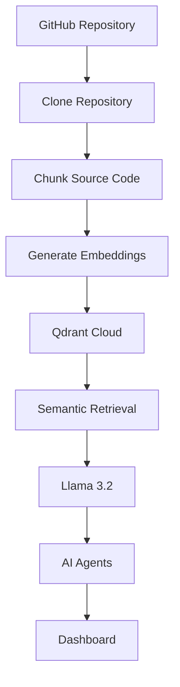

# RepoPilot AI

<p align="center">
  
</p>

<h1 align="center">RepoPilot AI</h1>

<p align="center">
AI-powered repository intelligence platform for automated code understanding, documentation generation, architecture analysis, security auditing, performance optimization, refactoring recommendations, and conversational repository exploration.
</p>

<p align="center">


</p>

---

## Overview

RepoPilot AI is an AI-powered software engineering assistant that analyzes GitHub repositories and generates intelligent insights using Retrieval-Augmented Generation (RAG), semantic search, local LLM inference, and specialized AI agents.

## Features

- Repository Analysis
- AI Repository Chat
- AI Documentation Generation
- Security Analysis
- Architecture Analysis
- Performance Optimization
- Refactoring Suggestions
- Repository Tree Visualization
- Semantic Code Search

---

# ⚙️ Tech Stack

## Frontend

- React
- Vite
- Tailwind CSS
- Axios
- React Router
- React Markdown

## Backend

- FastAPI
- Python
- Ollama
- Sentence Transformers
- Qdrant *(planned integration; currently uses an in-memory vector store)*
- Uvicorn

## AI

- Llama 3.2
- Retrieval-Augmented Generation (RAG)
- Semantic Search
- Local LLM Inference

## Vector Database

- Qdrant *(planned; in-memory vector store currently used during development)*

## Machine Learning

- sentence-transformers
- all-MiniLM-L6-v2

## Version Control

- Git
- GitHub

---

# Current Memory System

The current implementation stores embeddings in an **in-memory vector store**, allowing fast local semantic retrieval without external infrastructure.

```text
Repository
    ↓
Clone Repository
    ↓
Parse Source Files
    ↓
Chunk Code
    ↓
Generate Embeddings
    ↓
In-Memory Vector Store
    ↓
Semantic Retrieval
    ↓
Llama 3.2 (Ollama)
    ↓
AI Agent Response
```

### Advantages

- Zero configuration
- Extremely fast during local development
- Lightweight implementation
- Easy to understand and debug

### Limitations

- Embeddings are lost when the backend restarts
- No persistence
- Limited scalability
- No advanced filtering or indexing

---

# Planned Qdrant Migration

Future releases will replace the current in-memory vector store with **Qdrant Cloud**.

### Benefits

- Persistent vector storage
- Faster repeated queries
- Metadata filtering
- Production-ready scalability
- Multiple repository indexing
- Better retrieval performance



---

# Installation

## Backend

```bash
cd backend
pip install -r requirements.txt
uvicorn main:app --reload
```

## Frontend

```bash
cd frontend
npm install
npm run dev
```

---

# Deployment

**Frontend:** Vercel

**Backend:** Railway

---

# Roadmap

- ✅ Repository Analysis
- ✅ AI Chat
- ✅ Documentation Agent
- ✅ Security Agent
- ✅ Architecture Agent
- ✅ Performance Agent
- ✅ Refactor Agent
- ⏳ Qdrant Cloud Integration
- ⏳ Docker
- ⏳ Kubernetes
- ⏳ GitHub OAuth
- ⏳ Multi-Repository Support

---

# Screenshots

> Add screenshots and demo GIFs after deployment.

---

# License

MIT License

---

# Author

**Rishit Kumar Ojha**

AI Engineer • Generative AI • Agentic AI • RAG • LLM Applications

- GitHub: https://github.com/riko-bit
- LinkedIn: https://linkedin.com/in/rishit-kumar-ojha

If you found this project useful, consider giving it a ⭐ on GitHub.
